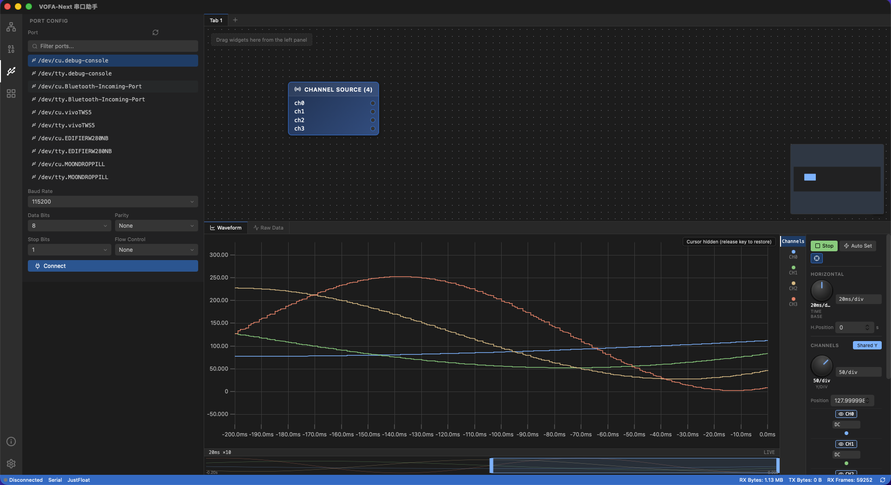

# VOFA-NEXT

[English](./README.md) | [简体中文](./README.zh-CN.md)

A next-generation serial assistant fully rebuilt with Rust + Tauri — built for embedded debugging, waveform visualization, node-based dataflow orchestration, CAN/automotive diagnostics, and logic analysis.

<!-- PROJECT SHIELDS -->

[![Contributors][contributors-shield]][contributors-url]
[![Forks][forks-shield]][forks-url]
[![Stargazers][stars-shield]][stars-url]
[![Issues][issues-shield]][issues-url]
[![MIT License][license-shield]][license-url]

<!-- PROJECT LOGO -->
<br />

<p align="center">
  <a href="https://github.com/horldsence/vofa-next">
    
  </a>

  <h3 align="center">VOFA-NEXT</h3>
  <p align="center">
    A modern serial debugging tool with waveform display, node editor, multi-protocol parsing, CAN diagnostics, and logic analysis.
    <br />
    <a href="https://github.com/horldsence/vofa-next"><strong>Explore the repo »</strong></a>
    <br />
    <br />
    <a href="https://github.com/horldsence/vofa-next/issues">Report Bug</a>
    ·
    <a href="https://github.com/horldsence/vofa-next/issues">Request Feature</a>
  </p>
</p>



## Table of Contents

- [Introduction](#introduction)
- [Core Features](#core-features)
- [Tech Stack](#tech-stack)
- [Project Structure](#project-structure)
- [Prerequisites](#prerequisites)
- [Installation & Running](#installation--running)
- [Build & Packaging](#build--packaging)
- [Testing](#testing)
- [Contributing](#contributing)
- [Versioning](#versioning)
- [License](#license)
- [Acknowledgements](#acknowledgements)

## Introduction

VOFA-NEXT is a desktop serial assistant designed for embedded debugging scenarios. The frontend is built with React 19 + TypeScript + Vite, while the backend is powered by Rust + Tauri 2 to deliver high-performance transport I/O, protocol parsing, a node-graph DAG engine, DSP (FIR/IIR filters, FFT spectrum), and automotive diagnostic protocols (ISO-TP / UDS / OBD-II / J1939).

The app supports 7 transport types, 7 protocol engines, a React Flow-based node editor for dataflow orchestration, oscilloscope-style waveform display, CAN frame / load analysis, logic analyzer with UART/I2C/SPI decoding, and a custom JS widget system running in sandboxed iframes.

## Core Features

### Transports

- **Serial** (USB-CDC) with configurable baud rate / data bits / parity / stop bits / flow control.
- **TCP Client** / **TCP Server**.
- **UDP** with independent local & remote addresses.
- **Test Data** — built-in signal generator (Sine / Square / Triangle / Sawtooth / Random / DC / Chirp / Steps / Noise / MultiTone), ideal for offline prototyping.
- **Slcan** — CAN over serial.
- **CandleLight** — native USB CAN backend.
- Auto-reconnect and connection-state notifications.

### Protocol Engines

- **JustFloat** & **FireWater** — VOFA+ protocols with automatic channel detection.
- **RawData** — raw byte stream inspection.
- **Slcan** / **CandleLight** — CAN frame parsing.
- **LogicDecode** — UART / I2C / SPI protocol decoding from sampled digital levels.
- **Diagnostic** — ISO-TP / UDS / OBD-II / J1939 automotive diagnostic stack (powered by `libautomotive`).

### Node Editor & Dataflow

- Built on **React Flow** — drag widgets from the sidebar onto the canvas and wire up dataflows.
- Backend **DAG engine** (`vofa-next-nodes`) compiles the graph into a topological order and evaluates all node outputs per frame, with cycle detection.
- Node kinds: `ChannelSource`, `Input`, `Math`, `Filter`, `SpectrumSink`, `FrameDecoder`, `Custom` (JS), `Sink`.
- **Math nodes**: Add / Sub / Mul / Div / Avg / Min / Max / Abs / Neg / Square / Sqrt / Sin / Cos / Tan / Log.
- **Filter nodes**: Lowpass / Highpass / Bandpass / Bandstop (FIR coefficients or IIR biquad), with cross-frame state persistence.
- **SpectrumSink**: block-based FFT with selectable window (Hann / Hamming / Blackman / Rect) and output modes (Magnitude / Power / PSD / dB), driven by an independent 30 FPS ticker.
- **FrameDecoder**: block-based byte-stream parser (Header / Length / Id / Field / Bitfield / Checksum / Tail) with multi-frame dispatch via `match_id` and checksum validation.
- **Custom JS nodes**: user JavaScript runs in a sandboxed iframe; outputs are posted back to the backend graph.

### Displays & Widgets

- **Oscilloscope-style waveform** — powered by uPlot, with timebase zoom, cursor measurements, Run/Stop freeze, per-channel independent / shared Y-axis, thumbnail zoom, crosshair, hover-point markers, and cursor snap.
- **Gauge / LED / NumberDisplay / PieChart / Label** — at-a-glance readouts.
- **Image viewer** — RGB888 / RGB565 / Gray8 pixel formats.
- **Spectrum chart** — real-time FFT visualization.
- **3D model viewer** — powered by Three.js / React Three Fiber.
- **CAN frame list / CAN sender / CAN load view** — with CSV export and load alarms.
- **Logic timing chart** + decoded event list (UART/I2C/SPI).
- **Command sender** (with block editor) and **frame decoder** manual test panel.
- **Custom widget editor** — CodeMirror 6-powered JS editor with live preview.

### UX & Platform

- VSCode-style layout: activity bar, sidebar, resizable panels, status bar, multiple tabs.
- Native menu bar (macOS / Windows / Linux) and global shortcuts.
- **i18n** — Chinese / English UI copy managed via YAML.
- **Settings modal** — general / appearance / editor / data / serial / notifications, persisted via `tauri-plugin-store`.
- Custom theme editor, onboarding wizard, help center, and contextual hints.
- Transparent window with acrylic / vibrancy effect (macOS).
- Native OS notifications via `tauri-plugin-notification`.
- Structured logging via `tauri-plugin-log` (stdout / log dir / webview).

## Tech Stack

### Frontend

- [React 19](https://react.dev/) + [TypeScript](https://www.typescriptlang.org/) + [Vite 7](https://vitejs.dev/)
- [Tailwind CSS 4](https://tailwindcss.com/) (via `@tailwindcss/vite`)
- [React Flow](https://reactflow.dev/) (`@xyflow/react`) — node editor
- [uPlot](https://github.com/leeoniya/uPlot) — waveform charts
- [Three.js](https://threejs.org/) + [`@react-three/fiber`](https://github.com/pmndjs/react-three-fiber) — 3D viewer
- [CodeMirror 6](https://codemirror.net/) — custom widget code editor
- [TanStack React Virtual](https://tanstack.com/virtual) — virtualized lists
- [react-resizable-panels](https://github.com/bvaughn/react-resizable-panels) — VSCode-style layout
- [Zustand](https://github.com/pmndrs/zustand) — state management
- [lucide-react](https://lucide.dev/icons/) — icons
- [YAML](https://github.com/eemeli/yaml) — i18n

### Backend

- [Rust](https://www.rust-lang.org/) + [Tauri 2](https://tauri.app/)
- [Tokio](https://tokio.rs/) — async runtime
- [Serde](https://serde.rs/) — serialization
- [parking_lot](https://github.com/Amanieu/parking_lot) — synchronization
- [window-vibrancy](https://github.com/tauri-apps/window-vibrancy) — acrylic / mica effects
- [libautomotive](https://crates.io/crates/libautomotive) — UDS / OBD-II / J1939 diagnostics
- Tauri plugins: `tauri-plugin-log`, `tauri-plugin-notification`, `tauri-plugin-store`, `tauri-plugin-opener`

### Backend Workspace Crates

| Crate | Responsibility |
| --- | --- |
| `vofa-next-core` | Core types & config (transports, protocols, widgets, CAN, logic, diagnostics) |
| `vofa-next-transport` | Transport layer (serial / TCP / UDP / Slcan / CandleLight / test data) + manager |
| `vofa-next-protocol` | Protocol engines (JustFloat / FireWater / RawData / Slcan / CandleLight / LogicDecode) |
| `vofa-next-buffer` | Ring buffer, multi-channel `DataBuffer`, raw-data collector, node-graph routing |
| `vofa-next-nodes` | DAG compiler & evaluator (Math / Filter / SpectrumSink / FrameDecoder / Custom) |
| `vofa-next-dsp` | Digital signal processing (FIR/IIR filters, FFT spectrum, window functions) |
| `vofa-next-automotive` | Diagnostic engine (ISO-TP / UDS / OBD-II / J1939) bridging CAN backends |

## Project Structure

```
vofa-next/
├── scripts/                       # Build & patch scripts
│   ├── build.sh
│   ├── patch_cmdsender.cjs
│   ├── patch_remaining.cjs
│   └── patch_widgetnode.cjs
├── src/                           # Frontend source
│   ├── components/
│   │   ├── controls/              # Knob / Button / Slider / Radio / Checkbox / Label
│   │   ├── displays/              # Waveform / Gauge / LED / PieChart / Spectrum /
│   │   │                          # Image / NumberDisplay / Model3D / TableView /
│   │   │                          # CanView / CanSender / CanLoadView / LogicView /
│   │   │                          # RawDataView / CommandSender / FrameDecoder / ...
│   │   ├── layout/                # ActivityBar / Sidebar / ControlPanel / DataPanel /
│   │   │                          # NodeEditor / StatusBar / BufferUsageStats
│   │   ├── nodes/                 # React Flow node types (ChannelSource / Widget)
│   │   ├── onboarding/            # OnboardingWizard / HelpCenter / Tour / ContextualHint
│   │   ├── panels/
│   │   │   ├── transport/         # Serial / Udp / TcpClient / TcpServer / TestData /
│   │   │   │                      # Slcan / Candle forms
│   │   │   ├── PortPicker.tsx
│   │   │   ├── ProtocolSection.tsx
│   │   │   ├── TransportConfigPanel.tsx
│   │   │   └── WidgetPalette.tsx
│   │   ├── ui/                    # ContextMenu / PanelTabs / ToolbarIconButton / WidgetCard
│   │   ├── AboutModal.tsx
│   │   ├── CodeEditor.tsx
│   │   ├── CustomWidgetEditor.tsx
│   │   ├── NotificationToasts.tsx
│   │   ├── SettingsModal.tsx
│   │   └── ThemeEditor.tsx
│   ├── i18n/                      # i18n loader + locales (en.yml / zh.yml)
│   ├── lib/                       # Tauri API / buffers / subscriptions / utils
│   ├── settings/                  # Settings schema, defaults, theme application
│   ├── store/                     # Zustand stores (slices for connection/data/graph/...)
│   ├── types/                     # TypeScript types (can / logic / transport / waveform / ...)
│   ├── App.tsx
│   └── main.tsx
├── src-tauri/                     # Tauri + Rust backend
│   ├── crates/                    # Rust workspace (see table above)
│   ├── src/
│   │   ├── commands/              # Tauri command handlers (transport/protocol/buffer/
│   │   │                          # graph/can/logic/can_load/frame_decoder/window/...)
│   │   ├── pipeline/              # data_loop / decoder_feed / graph_eval / spectrum_sync
│   │   ├── state/                 # AppState / tickers (graph output / custom input / spectrum)
│   │   ├── subscription/          # Event subscription manager
│   │   ├── commands.rs
│   │   ├── menu.rs                # Native menu bar
│   │   ├── notify.rs
│   │   ├── lib.rs
│   │   └── main.rs
│   ├── capabilities/default.json
│   ├── icons/                     # App icons (macOS / Windows / iOS / Android)
│   ├── build.rs
│   ├── Cargo.toml
│   └── tauri.conf.json
├── public/                        # Static assets (tauri.svg / vite.svg)
├── images/                        # README assets
├── .github/workflows/             # CI: build.yml / release.yml
├── package.json
├── pnpm-workspace.yaml
├── tsconfig.json
├── tsconfig.node.json
├── vite.config.ts
├── index.html
└── README.md
```

## Prerequisites

- [Node.js](https://nodejs.org/) (LTS recommended)
- [pnpm](https://pnpm.io/)
- [Rust](https://www.rust-lang.org/tools/install) (stable)
- [Tauri 2 system dependencies](https://tauri.app/start/prerequisites/)
- For CAN diagnostics: a compatible CAN interface (Slcan adapter or CandleLight-compatible USB dongle)

## Installation & Running

1. Clone the repository

```sh
git clone https://github.com/horldsence/vofa-next.git
cd vofa-next
```

2. Install frontend dependencies

```sh
pnpm install
```

3. Start the dev environment

```sh
pnpm tauri dev
```

The app loads the frontend at `http://localhost:1420` by default and launches a Tauri desktop window.

## Build & Packaging

Build production frontend assets and package the desktop app:

```sh
pnpm tauri build
```

Artifacts are output to `src-tauri/target/release/bundle/`.

Cross-platform build examples (see `scripts/build.sh`):

```sh
# Windows cross-compilation
pnpm tauri build --runner cargo-xwin --target x86_64-pc-windows-msvc

# macOS dmg package
pnpm tauri build --bundles dmg
```

CI workflows are provided in `.github/workflows/` (`build.yml`, `release.yml`).

## Testing

Frontend type check:

```sh
pnpm tsc --noEmit
```

Frontend production build:

```sh
pnpm build
```

Backend unit tests (workspace-wide):

```sh
cd src-tauri && cargo test
```

The backend enforces strict Clippy lints (`all` / `pedantic` / `nursery` / `cargo` denied by default with curated allows) — run `cargo clippy --workspace` before submitting PRs.

## Contributing

Contributions are what make the open-source community such a great place to learn, inspire, and create. Any contributions you make are **greatly appreciated**.

1. Fork this project
2. Create a feature branch: `git checkout -b feature/AmazingFeature`
3. Commit your changes: `git commit -m 'Add some AmazingFeature'`
4. Push to the branch: `git push origin feature/AmazingFeature`
5. Open a Pull Request

Please make sure `pnpm tsc --noEmit` and `cd src-tauri && cargo clippy --workspace && cargo test` pass before opening a PR.

## Versioning

This project is managed with Git. Available releases can be found on the [Releases](https://github.com/horldsence/vofa-next/releases) page.

## License

This project is licensed under the MIT License — see [LICENSE](./LICENSE) for details.

## Acknowledgements

- [VOFA+](https://www.vofa.plus/) for the FireWater / JustFloat protocol references
- [Tauri](https://tauri.app/)
- [React Flow](https://reactflow.dev/)
- [uPlot](https://github.com/leeoniya/uPlot)
- [Three.js](https://threejs.org/) / [React Three Fiber](https://github.com/pmndjs/react-three-fiber)
- [CodeMirror](https://codemirror.net/)
- [Tailwind CSS](https://tailwindcss.com/)
- [lucide-react](https://lucide.dev/)
- [libautomotive](https://crates.io/crates/libautomotive)

<!-- links -->
[contributors-shield]: https://img.shields.io/github/contributors/horldsence/vofa-next.svg?style=flat-square
[contributors-url]: https://github.com/horldsence/vofa-next/graphs/contributors
[forks-shield]: https://img.shields.io/github/forks/horldsence/vofa-next.svg?style=flat-square
[forks-url]: https://github.com/horldsence/vofa-next/network/members
[stars-shield]: https://img.shields.io/github/stars/horldsence/vofa-next.svg?style=flat-square
[stars-url]: https://github.com/horldsence/vofa-next/stargazers
[issues-shield]: https://img.shields.io/github/issues/horldsence/vofa-next.svg?style=flat-square
[issues-url]: https://github.com/horldsence/vofa-next/issues
[license-shield]: https://img.shields.io/github/license/horldsence/vofa-next.svg?style=flat-square
[license-url]: https://github.com/horldsence/vofa-next/blob/master/LICENSE
