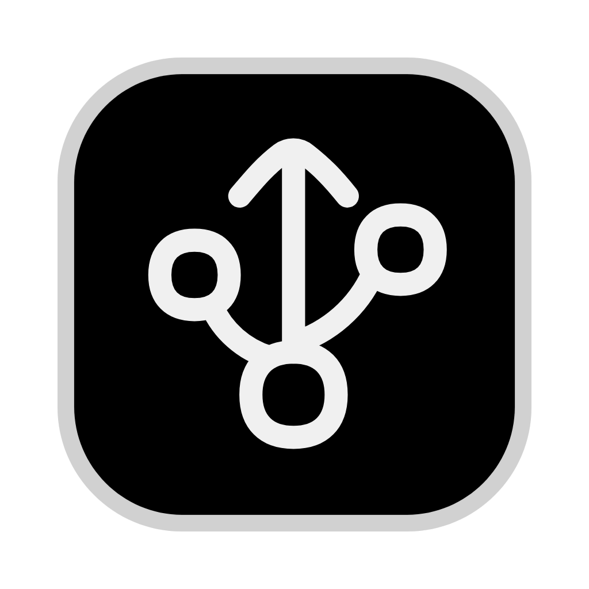

# VOFA-NEXT

一个使用 Rust + Tauri 完全重构的下一代串口助手。

<!-- PROJECT SHIELDS -->

[![Contributors][contributors-shield]][contributors-url]
[![Forks][forks-shield]][forks-url]
[![Stargazers][stars-shield]][stars-url]
[![Issues][issues-shield]][issues-url]
[![MIT License][license-shield]][license-url]

<!-- PROJECT LOGO -->
<br />

<p align="center">
  <a href="https://github.com/horldsence/vofa-next">
    
  </a>

  <h3 align="center">VOFA-NEXT</h3>
  <p align="center">
    现代化串口调试工具，支持波形显示、节点编辑器与多协议解析。
    <br />
    <a href="https://github.com/horldsence/vofa-next"><strong>查看项目仓库 »</strong></a>
    <br />
    <br />
    <a href="https://github.com/horldsence/vofa-next/issues">报告 Bug</a>
    ·
    <a href="https://github.com/horldsence/vofa-next/issues">提出新特性</a>
  </p>
</p>

## 目录

- [项目简介](#项目简介)
- [核心特性](#核心特性)
- [技术栈](#技术栈)
- [目录结构](#目录结构)
- [开发环境](#开发环境)
- [安装与运行](#安装与运行)
- [构建与打包](#构建与打包)
- [测试](#测试)
- [贡献指南](#贡献指南)
- [版本控制](#版本控制)
- [开源协议](#开源协议)
- [鸣谢](#鸣谢)

## 项目简介

VOFA-NEXT 是一款面向嵌入式调试场景的桌面串口助手。前端基于 React + TypeScript + Vite，后端由 Rust + Tauri 提供高性能串口 / TCP / UDP 数据读写与协议解析。项目支持节点式数据流编排、实时波形显示、多通道采样以及 VOFA 协议（FireWater、JustFloat）解析。

## 核心特性

- **多传输层支持**：串口（Serial）、TCP 客户端、UDP，支持自动重连与连接状态通知。
- **协议解析引擎**：内置 VOFA FireWater、JustFloat 协议，支持通道自动检测与原始数据查看。
- **示波器式波形显示**：基于 uPlot，支持时基缩放、游标测量、Run/Stop 冻结、通道 Y 轴独立/共享模式。
- **节点编辑器**：基于 React Flow，支持从侧边栏拖拽控件到画布并连接数据流。
- **国际化**：通过 YAML 管理中文 / 英文界面文案。
- **Tauri 插件集成**：使用 `tauri-plugin-log`、`tauri-plugin-notification`、`tauri-plugin-store` 实现日志、通知与配置持久化。

## 技术栈

### 前端

- [React 19](https://react.dev/)
- [TypeScript](https://www.typescriptlang.org/)
- [Vite](https://vitejs.dev/)
- [React Flow](https://reactflow.dev/)（节点编辑器）
- [uPlot](https://github.com/leeoniya/uPlot)（波形图表）
- [Zustand](https://github.com/pmndrs/zustand)（状态管理）
- [lucide-react](https://lucide.dev/icons/)（图标）

### 后端

- [Rust](https://www.rust-lang.org/)
- [Tauri 2](https://tauri.app/)
- [Tokio](https://tokio.rs/)（异步运行时）
- [Serde](https://serde.rs/)（序列化）

## 目录结构

```
serial+/
├── scripts/                  # 构建脚本
│   └── build.sh
├── src/                      # 前端源码
│   ├── components/           # React 组件
│   │   ├── controls/         # 控制控件（按钮、旋钮、滑块等）
│   │   ├── displays/         # 显示组件（波形图、原始数据等）
│   │   ├── layout/           # 布局组件（节点编辑器、数据面板等）
│   │   ├── nodes/            # React Flow 节点类型
│   │   └── panels/           # 配置面板
│   ├── i18n/                 # 国际化 YAML
│   ├── lib/                  # 工具库
│   ├── store/                # Zustand 状态
│   ├── types/                # TypeScript 类型
│   ├── App.tsx
│   └── main.tsx
├── src-tauri/                # Tauri + Rust 后端
│   ├── crates/               # Rust workspace 子 crate
│   │   ├── vofa-next-core/   # 核心类型与配置
│   │   ├── vofa-next-transport/  # 传输层（串口/TCP/UDP）
│   │   ├── vofa-next-protocol/   # 协议解析
│   │   └── vofa-next-buffer/     # 数据缓冲与绘图
│   ├── src/                  # Tauri 命令与状态
│   ├── icons/                # 应用图标
│   └── tauri.conf.json
├── package.json
├── pnpm-workspace.yaml
├── tsconfig.json
├── vite.config.ts
└── README.md
```

## 开发环境

- [Node.js](https://nodejs.org/)（建议 LTS）
- [pnpm](https://pnpm.io/)
- [Rust](https://www.rust-lang.org/tools/install)
- [Tauri 2 系统依赖](https://tauri.app/start/prerequisites/)

## 安装与运行

1. 克隆仓库

```sh
git clone https://github.com/horldsence/vofa-next.git
cd vofa-next
```

2. 安装前端依赖

```sh
pnpm install
```

3. 启动开发环境

```sh
pnpm tauri dev
```

应用默认会在 `http://localhost:1420` 加载前端，并启动 Tauri 桌面窗口。

## 构建与打包

生成生产环境前端资源并打包桌面应用：

```sh
pnpm tauri build
```

输出产物位于 `src-tauri/target/release/bundle/`。

项目脚本中也包含跨平台构建示例：

```sh
# Windows 交叉编译
pnpm tauri build --runner cargo-xwin --target x86_64-pc-windows-msvc

# macOS dmg 包
pnpm tauri build --bundles dmg
```

## 测试

前端类型检查：

```sh
pnpm tsc --noEmit
```

前端生产构建：

```sh
pnpm build
```

后端单元测试：

```sh
cd src-tauri && cargo test
```

或运行完整 Rust 构建：

```sh
cd src-tauri && cargo build
```

## 贡献指南

贡献使开源社区成为一个学习、激励和创造的绝佳场所。你所作的任何贡献都**非常感谢**。

1. Fork 本项目
2. 创建功能分支：`git checkout -b feature/AmazingFeature`
3. 提交改动：`git commit -m 'Add some AmazingFeature'`
4. 推送到分支：`git push origin feature/AmazingFeature`
5. 提交 Pull Request

## 版本控制

本项目使用 Git 进行版本管理。你可以在 [Releases](https://github.com/horldsence/vofa-next/releases) 页面查看可用版本。

## 开源协议

本项目基于 MIT 协议开源，详情请参阅 [LICENSE](./LICENSE)。

## 鸣谢

- [VOFA+](https://www.vofa.plus/) 提供的 FireWater / JustFloat 协议参考
- [Tauri](https://tauri.app/)
- [React Flow](https://reactflow.dev/)
- [uPlot](https://github.com/leeoniya/uPlot)
- [lucide-react](https://lucide.dev/)

<!-- links -->
[contributors-shield]: https://img.shields.io/github/contributors/horldsence/vofa-next.svg?style=flat-square
[contributors-url]: https://github.com/horldsence/vofa-next/graphs/contributors
[forks-shield]: https://img.shields.io/github/forks/horldsence/vofa-next.svg?style=flat-square
[forks-url]: https://github.com/horldsence/vofa-next/network/members
[stars-shield]: https://img.shields.io/github/stars/horldsence/vofa-next.svg?style=flat-square
[stars-url]: https://github.com/horldsence/vofa-next/stargazers
[issues-shield]: https://img.shields.io/github/issues/horldsence/vofa-next.svg?style=flat-square
[issues-url]: https://github.com/horldsence/vofa-next/issues
[license-shield]: https://img.shields.io/github/license/horldsence/vofa-next.svg?style=flat-square
[license-url]: https://github.com/horldsence/vofa-next/blob/master/LICENSE
