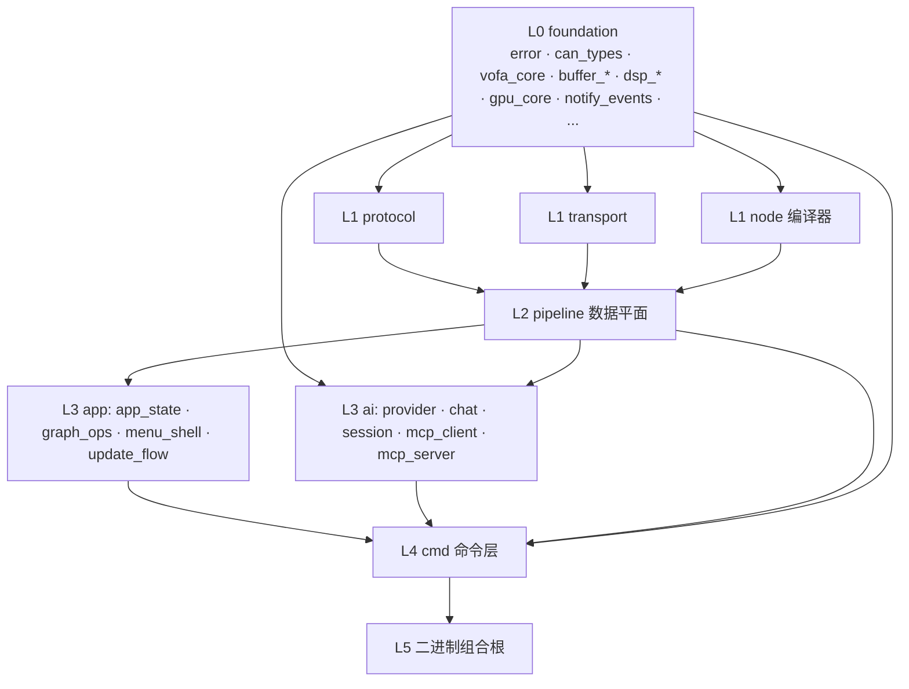

# Crate 分层架构

> 本文是 `src-tauri/` Rust workspace 的层级权威说明。workspace 根 manifest
> (`src-tauri/Cargo.toml`) 的 members 分组与本文一致;
> `pnpm check:layers` 依据 `cargo metadata` 机械校验依赖规则。

## 总览

Workspace 共 60 个 crate（59 个成员 crate + 1 个二进制组合根）。层级由
**目录结构** 表达，crate 名只表达**功能** —— 目录即层，名不重复层级前缀
（例如图提交命令层是 `crates/cmd/graph`，而不是 `crates/cmd/cmd_graph`）。

```
src-tauri/
├── src/                  # L5 二进制组合根: 插件装配 + generate_handler (纯装配, 无业务逻辑)
└── crates/
    ├── foundation/       # L0 基础层
    ├── protocol/         # L1 协议
    ├── transport/        # L1 传输
    ├── node/             # L1 节点图编译器
    ├── pipeline/         # L2 数据平面
    ├── app/              # L3 应用核心
    ├── ai/               # L3 AI/MCP 基础设施
    └── cmd/              # L4 Tauri IPC 命令层
```

## 依赖规则

1. **rank 规则**: 依赖只允许 `rank(被依赖方) ≤ rank(依赖方)`，同层可互依。

   ```
   foundation(0) < protocol / transport / node(1) < pipeline(2) < app / ai(3) < cmd(4) < 二进制(5)
   ```

2. **cmd 层隔离**: `crates/cmd/*` 禁止被任何非 cmd crate 依赖（二进制除外）。
   命令层只做参数反序列化、`State` 借用与命令注册，可复用的逻辑必须下沉到
   L3 或以下（范例: 图提交核心在 `app/graph_ops`，`cmd/graph` 与 `ai/mcp_server`
   共用同一实现）。

3. **testkit 规则**: `node/testkit` 只能作为 dev-dependency 使用。

4. **dev-dependency 豁免**: rank 规则只约束运行时依赖（normal/build）；
   dev-dependency 只进测试构建、不进发布依赖图。已知特例:
   `data_plane --(dev)--> app_state`（frame_dispatch/reconcile 集成测试
   借用 AppState 构造真实环境）。`check:layers` 对此机械放行。

4. **命名规则**: crate 目录名 = package 名；名字不与所在层目录重复前缀。
   保留前缀的两种情况:
   - 前缀承担领域语义且无同名目录: `buffer_*`、`dsp_*`、`mcp_*`、`automotive_*`、
     `can_types`、`logic_types`、`schema_types`；
   - 裸名与 std 保留名/其他 crate 冲突或失去信息量: `protocol_engine`（`engine`
     已被 node 层占用）、`protocol_can_bridge`（与 transport 层 `can_bridge` 区分）、
     `transport_core` 与 `vofa_core`（`core` 会遮蔽 std core crate）。

## 分层与 crate 清单

### L0 `crates/foundation/` — 基础层

错误/类型/缓冲/DSP 原语/自包含基础设施。**禁止依赖任何上层。**

| crate | 职责 |
|---|---|
| `error` | 统一错误抽象: Error trait + AppError + CompileReport |
| `can_types` | CAN 领域类型: 帧/方向/波特率/负载统计 |
| `vofa_core` | 应用基础类型: DataFrame/RawData/TransportConfig/WidgetConfig/PipelineConfig |
| `logic_types` | 逻辑分析仪类型: 采样/事件/过滤 |
| `diagnostic` | 诊断协议类型: ISO-TP/UDS/OBD-II/J1939 |
| `schema_types` | 自定义帧 schema 类型: 校验/字段/解码块/HEX |
| `buffer_ring` | 泛型环形缓冲 |
| `buffer_raw` | 原始字节环形收集 + 方向/内容过滤 |
| `buffer_graph` | 节点图缓冲 + RoutedData 路由 |
| `buffer_databuffer` | 多通道波形缓冲 (时间序列 + 派生通道) |
| `dsp_window` | 窗函数 |
| `dsp_filter` | 数字滤波器 |
| `dsp_fft` | FFT/频谱 |
| `subscription` | 订阅取消统一管理 |
| `gpu_core` | wgpu compute: 波形包络降采样 (CPU 回退) |
| `notify_events` | 前端事件名契约 (`transport:state` 等) + 系统通知封装 |

### L1 `crates/protocol/` — 协议解析/编码

| crate | 职责 |
|---|---|
| `protocol_engine` | ProtocolEngine trait + 输入输出容器 |
| `protocol_float` | JustFloat + FireWater（VOFA 经典协议） |
| `protocol_can_bridge` | SLCAN + CandleLight + RawData 协议引擎 |
| `logic_decoder` | 逻辑解码: UART/I2C/SPI |
| `schema_engine` | 自定义帧 schema 流式解析/编码 |

### L1 `crates/transport/` — 通道收发

| crate | 职责 |
|---|---|
| `serial` | 串口传输 + Windows COM 枚举 |
| `net` | TCP client/server + UDP |
| `can_bridge` | SLCAN (串口) + CandleLight (USB bulk) 物理桥接 |
| `transport_core` | TransportHandle/TransportManager/CanBackend trait + 测试数据源 |
| `automotive_can` | CAN 桥接集成 (CanBackend 实现) |
| `automotive_isotp` | ISO 15765-2 传输层 |
| `automotive_diag` | 诊断服务 (UDS/OBD, 占位待实现) |

### L1 `crates/node/` — 节点图编译器与运行时

编译管线: `hir → plane → lower → eval`，门面 `engine` 对外。

| crate | 职责 |
|---|---|
| `kind` | 节点种类系统: NodeKind/NodeDef/PortDomain/MathOp |
| `hir` | 编译前端: TypedGraph + 边分类 |
| `plane` | 编译中端: 值/字节平面投影 + BytePlan |
| `lower` | 编译后端: 槽位分配 → SlotPlan |
| `eval` | 槽位运行时: CompiledEval 逐帧求值 |
| `engine` | 门面: 三段编译管线 + CompiledGraph |
| `frame_decoder` | 字节流→帧状态机 (镜像前端 DecoderBlock) |
| `trigger` | 触发规则引擎 (Exact/Prefix/Contains/Regex/Range/Glob) |
| `testkit` | 测试工厂 (**仅 dev-dependency**) |

### L2 `crates/pipeline/` — 数据平面

| crate | 职责 |
|---|---|
| `data_plane` | 核心: 字节路由 + 数值求值 (SciRS2 SIMD) + 每源缓冲 (内部模块见下) |
| `data_bus` | actor-per-topic 数据总线 (环形历史 + 广播) |
| `stream` | 统一分片流框架 (StreamSource + AdaptiveRate) |
| `dispatcher` | 频谱/Ifft 同步 + 过滤源订阅 |

**`data_plane` 内部模块地图**（体量最大、热路径最集中，刻意保持单 crate，
新代码按此落位）:

| 模块 | 职责 |
|---|---|
| `data_plane::read_task` | 每 Transport 读任务: subscribe → 收集 → 路由 |
| `data_plane::byte_router` | 全局 BytePlan 字节路由 (Protocol.in / FrameDecoder.in / Transport.tx) |
| `data_plane::frame_dispatch` | 帧→数值平面调度 + 快照评估 |
| `data_plane::reconcile` | 孤儿协议节点运行时资源清理 |
| `decoder_feed` | FrameDecoder 节点喂入缓存 |
| `feed_parallel` | RX 解析段自动并行编排 |
| `graph_eval` / `graph_eval_parallel` | 数值平面批量求值 (SIMD) |
| `eval_state` | GraphEvalState/StreamGroupState + snapshot 批次类型 |

### L3 `crates/app/` — 应用核心

| crate | 职责 |
|---|---|
| `app_state` | AppState 全局状态容器 + ticker + 工作区持久化 + `runtime` 模块 (后台任务装配) |
| `graph_ops` | 图提交核心: apply_tab_graph/拓扑 op/派生数据/编译队列 (**无 Tauri IPC**, cmd 与 mcp_server 共用) |
| `menu_shell` | 原生菜单栏构建 + 菜单事件路由 |
| `update_flow` | 应用更新检查/下载安装 |

### L3 `crates/ai/` — AI/MCP 基础设施

| crate | 职责 |
|---|---|
| `provider` | LLM provider 聚合 (genai, 26+ 原生协议) |
| `session` | AI 会话持久化 |
| `chat` | 多轮工具调用循环 + 流式 + 取消 |
| `mcp_client` | 外部 MCP server 客户端管理 (stdio/http) |
| `mcp_server` | 把应用能力暴露为 MCP 工具 (127.0.0.1 streamable-http) |

### L4 `crates/cmd/` — Tauri IPC 命令层

薄适配: 参数反序列化 + `State` 借用 + 命令注册。可复用逻辑必须下沉。

| crate | 职责 |
|---|---|
| `graph` | 节点图/逻辑分析仪/工作区命令 (提交核心调 `graph_ops`) |
| `display` | 统一订阅入口 `subscribe_data` (VNDP v1 二进制列式协议) |
| `ai` | AI 对话/MCP 管理/keyring 命令 |
| `buffer` | 波形缓冲查询 + 命令帧字节打包 |
| `can_transport` | 传输/协议/CAN 帧命令 |
| `can_load` | CAN 负载统计 + CSV 导出 |
| `rawdata` | 缓冲容量/清空 + FrameDecoder 手动解析 |
| `pipeline` | PipelineConfig + 触发匹配命令 |
| `debug` | inspect_element |

### L5 二进制 `src/`

`main.rs` + `lib.rs`: 插件装配、`AppState`/`AiState` manage、菜单挂载、
启动恢复、后台任务启动 (`app_state::spawn_background_tasks`)、
退出 flush、`generate_handler!` 命令注册。**不承载业务逻辑。**

## 依赖图（mermaid）



## 新增 crate checklist

1. 先问: 真的需要新 crate 吗？优先放入现有层内相邻 crate。
2. 目录 = 层（见上表），crate 名 = 功能名，不重复层级前缀；
   保留领域前缀时在 description 里说明理由。
3. `Cargo.toml` 继承 `version.workspace` / `edition.workspace`，
   内部依赖一律 `X = { workspace = true }`（禁止裸 path），**必须含**
   `[lints] workspace = true`。
4. `lib.rs` 头注释三行式: 一句话职责 + `层级: LN <层名> — ...; 允许依赖 ...`
   + 关键约定。
5. 在根 manifest `members` 与 `workspace.dependencies` 按层登记（带层注释的
   分组内插入）。
6. 跑 `pnpm check:layers` 确认 rank 规则未被破坏。

## 历史备注

- 2026-09 整理: 由 58 个平铺 crate 重组为 8 层目录；28 个 crate 去除与
  目录重复的前缀（`cmd_graph → graph`、`node_engine → engine` 等）；
  新建 `graph_ops` 解除 `mcp_server → graph` 的层级倒置；删除 19 条被
  `subscribe_data` 统一入口取代的遗留订阅命令；补齐 buffer_* 的 workspace
  lints。整理前结构见 git 历史 (`50bc1fe` 及更早)。
